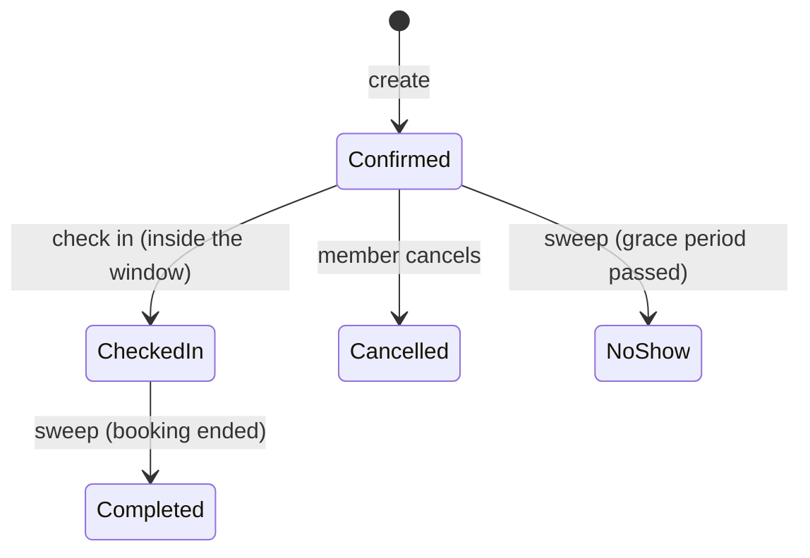

# Masar — Smart Workspace Booking API

Masar is a backend API for booking shared workspaces — study rooms, meeting rooms, focus pods and private offices — across multiple locations. Members search for available workspaces and book them; managers and admins run the catalog, schedule maintenance and administer accounts.

It is built with **ASP.NET Core (.NET 10)**, **EF Core**, **SQL Server**, **ASP.NET Core Identity + JWT** and **Hangfire**, and its main engineering focus is **correctness under concurrency**: two people racing for the same slot can never both win.

---

## Highlights

- **Double-booking protection at the database level.** Booking creation runs inside a `SERIALIZABLE` SQL Server transaction. Proven by integration tests that fire concurrent requests at a real database.
- **Booking limits that can't be bypassed.** The active-booking limit is re-checked *inside* the same transaction, so one member firing parallel requests at different workspaces still cannot exceed it.
- **A real booking lifecycle.** `Confirmed → CheckedIn → Completed`, plus `Cancelled` and `NoShow`, enforced with atomic conditional `UPDATE`s so racing transitions can never both succeed.
- **Background jobs.** Hangfire sweeps mark no-shows and complete finished bookings every 5 minutes; both jobs are idempotent and retry-safe.
- **Account changes take effect immediately.** Deactivating a user or changing their roles invalidates their existing JWTs through the Identity security stamp — no waiting for token expiry.
- **Consistent errors.** Every error, including bare 401/403/404 and unhandled exceptions, is returned as `{ "code": "...", "message": "..." }`. No exception text ever reaches a client.
- **Tested against real SQL Server.** Unit tests, database-backed integration tests (races included) and end-to-end HTTP tests.

---

## Tech stack

| Concern | Choice |
|---|---|
| Framework | ASP.NET Core, .NET 10, controllers |
| Data access | EF Core 10 (SQL Server provider), used directly — no repository/unit-of-work layer |
| Authentication | ASP.NET Core Identity + JWT bearer |
| Validation | FluentValidation |
| Background jobs | Hangfire (SQL Server storage) |
| Logging | Serilog (file sink, structured properties) |
| API docs | OpenAPI + Swagger UI (Development only) |
| Tests | xUnit, `WebApplicationFactory`, real SQL Server |

---

## Architecture

Layered, with dependencies pointing inward:

```
MASAR.API              Controllers, middleware, Program.cs
   │
   ├── MASAR.Infrastructure   EF Core DbContext, migrations, services, Hangfire jobs
   │        │
   └────────┴── MASAR.Application   DTOs, interfaces, validators, shared helpers (Result<T>, EgyptTime)
                     │
                MASAR.Domain        Entities and enums
```

```
MASAR.sln(x)
├── MASAR.API/                 Controllers, ExceptionHandling, Program.cs, appsettings
├── MASAR.Application/         DTOs, Interfaces, Validators, Common (Result<T>, EgyptTime, CheckInWindow)
├── MASAR.Domain/              Entities, Enums
├── MASAR.Infrastructure/      Persistence (DbContext, configurations, migrations, seeding),
│                              Services, Jobs
├── MASAR.UnitTests/           No database required
└── MASAR.IntegrationTests/    Real SQL Server + in-process API tests
```

Services return a `Result<T>` (`Succeeded`, `ErrorCode`, `ErrorMessage`, `Response`) for **expected** outcomes such as validation failures and business conflicts. Controllers map error codes to HTTP statuses. Exceptions are reserved for the unexpected and are handled by one global handler.

---

## Domain model

`ApplicationUser` · `Location` · `Workspace` · `Amenity` · `WorkspaceAmenity` · `MaintenancePeriod` · `Booking`

A **Location** contains **Workspaces**. A workspace has a type, capacity, operating hours and an active/inactive status, and can offer any number of **Amenities**. A **MaintenancePeriod** blocks a workspace for an interval. A **Booking** reserves a workspace for a member for an interval on a single day.

### Booking lifecycle



- There is no `Pending` state; bookings are created directly as `Confirmed`.
- Cancelling changes the status — rows are never deleted, so history is preserved.
- Only `Confirmed` and `CheckedIn` bookings block a workspace.
- A checked-in booking cannot be cancelled.

---

## Business rules

**Creating a booking** (`POST /api/bookings`, Members only):

| Outcome | Status | Code |
|---|---|---|
| Start time in the past | 422 | `BOOKING_IN_PAST` |
| Outside the workspace's operating hours | 422 | `OUTSIDE_OPERATING_HOURS` |
| Invalid interval (start not before end; no cross-midnight bookings) | 400 | `VALIDATION_FAILED` |
| Workspace not found | 404 | `WORKSPACE_NOT_FOUND` |
| Workspace or its location inactive | 409 | `WORKSPACE_INACTIVE` / `LOCATION_INACTIVE` |
| Overlaps a maintenance period | 409 | `MAINTENANCE_CONFLICT` |
| Overlaps an existing active booking | 409 | `WORKSPACE_UNAVAILABLE` |
| Member already has 2 active bookings | 409 | `ACTIVE_BOOKING_LIMIT_EXCEEDED` |

The overlap rule is `Existing.Start < New.End AND Existing.End > New.Start`, evaluated only against `Confirmed` and `CheckedIn` bookings.

**Check-in** is allowed only inside the window `[Start − 15 min, min(Start + 15 min, End))`. The lower bound is inclusive, the upper bound exclusive.

**Maintenance** works in both directions: bookings are rejected during maintenance, and maintenance cannot be scheduled over a live booking (`409 MAINTENANCE_BOOKING_CONFLICT`). Maintenance never silently cancels anyone's booking.

**Admin safeguards:** an admin cannot change their own roles or account state, and the last active admin can never be demoted or deactivated. Deactivating a user cancels their future `Confirmed` bookings, releasing the capacity immediately.

---

## Roles and permissions

| Role | Can do |
|---|---|
| **Member** | Search workspaces; create, check in, cancel and view **their own** bookings |
| **WorkspaceManager** | Create/update locations and workspaces, activate/deactivate workspaces, replace a workspace's amenities, manage maintenance periods, view all bookings |
| **Admin** | Everything a manager can, plus: activate/deactivate locations, manage the amenity catalog, manage users and roles |

Registration always creates a **Member**. Staff roles are granted by an Admin (see [First admin](#first-admin)). Booking endpoints are deliberately Member-only.

---

## API overview

All endpoints except `register` and `login` require `Authorization: Bearer <token>`.

### Auth
| Method | Route | Access |
|---|---|---|
| POST | `/api/auth/register` | Anonymous |
| POST | `/api/auth/login` | Anonymous |

### Locations
| Method | Route | Access |
|---|---|---|
| POST | `/api/locations` | Manager, Admin |
| GET | `/api/locations`, `/api/locations/{id}` | Authenticated |
| PUT | `/api/locations/{id}` | Manager, Admin |
| PATCH | `/api/locations/{id}/activate` · `/deactivate` | Admin |

### Workspaces and amenities
| Method | Route | Access |
|---|---|---|
| GET | `/api/workspaces/search` | Authenticated |
| POST | `/api/workspaces` | Manager, Admin |
| GET | `/api/workspaces/{id}` | Authenticated |
| PUT | `/api/workspaces/{id}` | Manager, Admin |
| PATCH | `/api/workspaces/{id}/activate` · `/deactivate` | Manager, Admin |
| PUT | `/api/workspaces/{id}/amenities` | Manager, Admin |
| POST | `/api/amenities` | Admin |
| GET | `/api/amenities` | Authenticated |

Search filters: `locationId`, `minCapacity`, `type`, `amenityIds`, `date`, `startTime`, `endTime`, `page`, `pageSize`. A workspace is returned only if it is active, in an active location, large enough, has *all* requested amenities, is open for the interval, and has no maintenance or booking overlap. Results are ordered by `Id` for stable pagination.

### Bookings
| Method | Route | Access |
|---|---|---|
| POST | `/api/bookings` | Member |
| POST | `/api/bookings/{id}/checkin` | Member (owner) |
| POST | `/api/bookings/{id}/cancel` | Member (owner) |
| GET | `/api/bookings` | Member — own history, `status` filter, paged (default 20, max 50), newest first |
| GET | `/api/bookings/{id}` | Member (owner) |
| GET | `/api/bookings/management` | Manager, Admin — all bookings |

Someone else's booking is indistinguishable from a missing one: both return `404 BOOKING_NOT_FOUND`.

### Maintenance periods
| Method | Route | Access |
|---|---|---|
| POST | `/api/maintenance-periods` | Manager, Admin |
| GET | `/api/maintenance-periods/workspace/{workspaceId}`, `/api/maintenance-periods/{id}` | Manager, Admin |
| PUT / DELETE | `/api/maintenance-periods/{id}` | Manager, Admin |

### Administration
| Method | Route | Access |
|---|---|---|
| GET | `/api/admin/users`, `/api/admin/users/{id}` | Admin |
| PUT | `/api/admin/users/{id}/roles` | Admin — replaces the user's whole role set |
| PATCH | `/api/admin/users/{id}/activate` · `/deactivate` | Admin |

---

## Error handling

Every error response has the same shape:

```json
{
  "code": "WORKSPACE_UNAVAILABLE",
  "message": "This workspace is already booked for the requested time."
}
```

| Status | Meaning |
|---|---|
| 400 | The request could not be read or failed validation (`VALIDATION_FAILED`) |
| 401 | Missing, invalid, expired, or no-longer-valid token (`UNAUTHORIZED`) |
| 403 | Authenticated but the role is not allowed (`FORBIDDEN`) |
| 404 | Resource not found (or not yours) |
| 409 | Conflicts with stored state: overlap, maintenance, limits, inactive workspace |
| 422 | Well-formed but impossible: past booking, outside operating hours, outside the check-in window |
| 503 | A retryable concurrency conflict (`CONCURRENT_WRITE_CONFLICT`, with `Retry-After`) |
| 500 | Unexpected error (`INTERNAL_ERROR`). The body carries only a trace id; details are in the server log |

A single global exception handler produces the 5xx responses; a status-code middleware fills in empty 401/403/404/405 bodies; model-binding failures are turned into a 400 in one central place.

---

## Concurrency design

The classic race: two users both see a slot as available, then both insert a booking.

```
Begin SERIALIZABLE transaction
  re-check overlapping bookings
  re-check the member's active-booking limit
  insert the booking
Commit
```

- `SERIALIZABLE` makes SQL Server protect the range that was read, so the second transaction either waits and then sees the first booking, or is chosen as a deadlock victim.
- A deadlock victim (SQL error 1205) is reported as a clean, retryable `503 CONCURRENT_WRITE_CONFLICT`, never as a crash.
- The cheaper pre-checks that run *before* the transaction (limit, maintenance) are fast-fail optimisations only; the authoritative checks live inside the transaction.
- Check-in, cancel, no-show and completion are single conditional `UPDATE ... WHERE Status = <expected>` statements. Whichever transition commits first wins, and the loser changes nothing.

Alternatives considered and rejected: application-level locking, pre-created booking slots, `RowVersion`, and generic Repository/Unit-of-Work abstractions. There is deliberately **no automatic retry** in v1; clients retry on 503.

---

## Background jobs

Two recurring Hangfire jobs run every 5 minutes (registered at startup through `IRecurringJobManager`):

| Job | Rule |
|---|---|
| No-show sweep | `Confirmed` bookings whose start time plus the 15-minute grace period has passed become `NoShow` |
| Completion sweep | `CheckedIn` bookings whose end time has passed become `Completed` |

Both are conditional updates, so running them twice, or racing a user action, is safe. Failures are logged with job context and rethrown so Hangfire's normal retry applies.

---

## Time handling

Masar is Egypt-only in v1. API inputs and outputs use **Egypt local** date and time; the database stores **UTC**. Conversion goes through one helper (`EgyptTime`) using the `Africa/Cairo` zone, which observes daylight-saving time. A wall-clock time that does not exist on the spring-forward night is rejected with a 400 rather than crashing.

---

## Logging

Serilog writes structured logs to `logs/log-<date>.txt`. Each request is logged with method, path, status code, duration, `UserId` and `TraceId`; query strings and headers are not logged. Booking operations, deadlocks, rejected tokens (user id and reason only — never the token), and background job failures are logged. Passwords, tokens and signing keys are never written to logs.

---

## Getting started

### Prerequisites

- [.NET 10 SDK](https://dotnet.microsoft.com/download)
- SQL Server (Express is fine)
- The EF Core CLI: `dotnet tool install --global dotnet-ef`

### 1. Configure

Edit the connection strings in `MASAR.API/appsettings.Development.json` (or use user-secrets):

```json
"ConnectionStrings": {
  "DefaultConnection": "Server=localhost\\SQLEXPRESS;Database=MASAR_DB;Trusted_Connection=True;TrustServerCertificate=True;",
  "HangfireConnection": "Server=localhost\\SQLEXPRESS;Database=MASAR_Jobs;Trusted_Connection=True;Encrypt=False"
}
```

Create an empty `MASAR_Jobs` database for Hangfire; it creates its own tables.

Set the JWT signing key. It must be at least 32 bytes and **must never be committed**:

```bash
cd MASAR.API
dotnet user-secrets set "Jwt:SigningKey" "<a-long-random-secret-of-32+-bytes>"
```

### 2. Create the database

```bash
dotnet ef database update --project MASAR.Infrastructure --startup-project MASAR.API
```

### 3. Run

```bash
dotnet run --project MASAR.API
```

On startup the app seeds the three roles (idempotent) and registers the recurring jobs. In Development, Swagger UI is available at `/swagger`.

### First admin

Self-registration only ever creates Members, so the first Admin is promoted manually. Register a user through the API, then run:

```sql
INSERT INTO AspNetUserRoles (UserId, RoleId)
SELECT u.Id, r.Id
FROM AspNetUsers u CROSS JOIN AspNetRoles r
WHERE u.Email = 'you@example.com' AND r.Name = 'Admin';
```

Log in again to get a token that carries the Admin role. From then on, use `PUT /api/admin/users/{id}/roles` to grant other roles.

---

## Testing

```bash
dotnet test MASAR.UnitTests          # no database needed
dotnet test MASAR.IntegrationTests   # needs SQL Server
```

| Layer | What it proves |
|---|---|
| **Unit tests** | Request validators (interval rules, DST gap), the check-in window boundaries, Egypt time conversion, the error-response mapping and the global exception handler |
| **Integration tests (real SQL Server)** | Booking rules against the real service; double-booking races (2 and 6 contenders, overlapping slots); the booking limit under concurrency; maintenance conflicts in both directions; every valid and invalid lifecycle transition; check-in vs no-show and cancel vs no-show races; idempotent sweeps; booking-history ownership; the admin last-active-admin race |
| **HTTP tests (in-process API)** | The full flow register → login → search → book → history → check in → details → completion; 400/401/403/404/409/422 behaviour and the error envelope; token invalidation after deactivation or a role change; unhandled exceptions becoming a safe 500 |

The integration tests create and drop their own database, **`MASAR_TestDb`**, from the real migrations on every run. Point them at your SQL Server by editing `MASAR.IntegrationTests/testsettings.json` (or the `ConnectionStrings__TestConnection` environment variable). The database name must contain "Test" or the run refuses to start, so the tests can never touch your real data.

Race tests assert **invariants** ("exactly one wins", "never two transitions"), not a fixed winner, because the winner differs from run to run.

---

## Project decisions

- **EF Core directly**, no repository or unit-of-work layer — it would only wrap `DbContext`.
- **`SERIALIZABLE` over alternatives** — one mechanism the database enforces, instead of application-level locking.
- **Bookings are never deleted**; status transitions keep history.
- **No `Pending` booking state** and no separate check-in table.
- **One error envelope** and a fixed status-code convention (422 for impossible requests, 409 for conflicts with stored state).
- **Scope was locked.** Docker, security hardening and extra polish (Steps 18–21) were deliberately left out so V1 could be finished.

---

## Roadmap

| Step | Topic | Status |
|---|---|---|
| 1–6 | Domain design, booking rules, concurrency strategy, EF model, migrations, authentication | Done |
| 7–9 | Location, workspace and amenity management | Done |
| 10 | Search and availability | Done |
| 11–12 | Booking creation and double-booking protection | Done |
| 13 | Booking lifecycle and background jobs | Done |
| 14 | Booking history and management | Done |
| 15 | Admin and platform management | Done |
| 16 | Logging and global error handling | Done |
| 17 | Testing | Done |
| 18–21 | Docker, security hardening, polish | Out of scope for V1 |

---

## Known limitations

- **No automatic retry on deadlock.** A losing request gets a retryable 503 and the client retries.
- **Maintenance vs booking race.** The maintenance conflict check is an ordinary pre-check, so a booking created in the instant between that check and the insert can still land inside a new maintenance window.
- **No QR validation.** Check-in is a plain authenticated call; QR verification was deferred.
- **No admin or manager cancel.** Only a booking's owner can cancel it, so maintenance over a booked slot must wait for the owner to cancel.
- **No manual first-admin seed.** The first Admin is promoted with a one-off SQL statement.
- **Authentication basics only.** No refresh tokens, login rate limiting or lockout, and the Hangfire dashboard is disabled.
- **Single time zone.** Egypt only.
- **No "platform configuration" settings** beyond what is hard-coded (2 active bookings, 15-minute grace period, 5-minute sweeps).

---

## Author

Built by [Yousry Bahbah](https://github.com/YousryBahbah).
